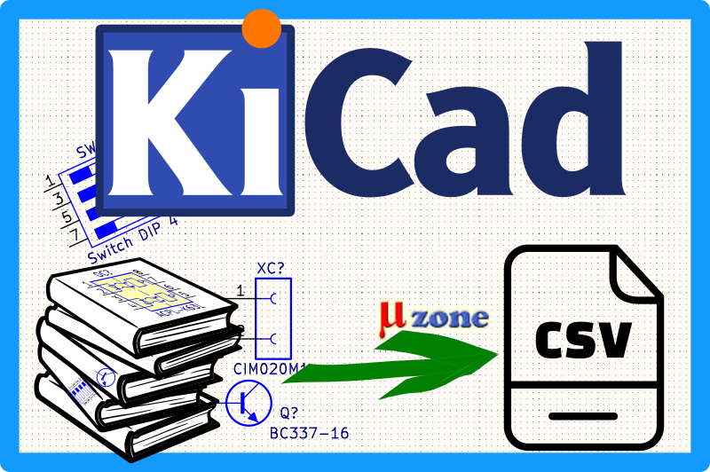

# KiCad to CSV library's parameters exporter

Utility to export KiCad symbols and footprints parameters from the symbol or footprint library to `.csv` format with user-defined fields.



## Prerequisites

- Python 3.7 or higher
- Python3-pip
- `requirements.txt`
  - [kiutils](https://github.com/mvnmgrx/kiutils)


## Installation

```sh
pip install -r requirements.txt
```


# Usage

## Display help

```
$ python3 kicad-from-to-csv.py --help
usage: kicad-from-to-csv.py [-h] [-d] [-v] -a {import,export} kicad_dirfile csv_dirfile

KiCad to CSV library's parameters exporter

positional arguments:
  kicad_dirfile         Path to directory or single file (.kicad_sym|.pretty)
  csv_dirfile           Path to directory or single file (.csv)

optional arguments:
  -h, --help                    Show this help message and exit
  -d, --debug                   Display debug output
  -v, --version                 Show program's version number and exit
  -a, --action {import|export}  Action to be used for processing (import|export)
```


## Export

```sh
# process single file
python3 kicad-from-to-csv.py -a export <my-file.kicad_sym> my-file.csv

# process all files in directory
python3 kicad-from-to-csv.py -a export <path-to-kicad_sym-directory> my-dir.csv
```
