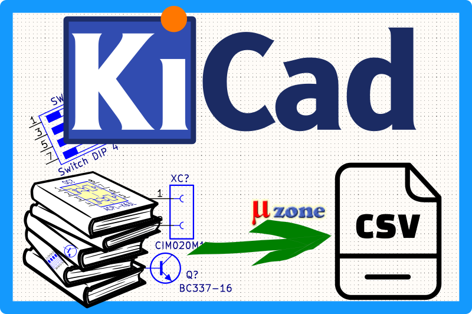
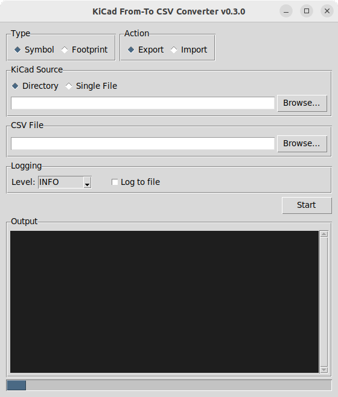

# KiCad library parameters CSV handler

Export KiCad symbol/footprint library element parameters to CSV, edit them in your favourite spreadsheet editor (LibreOffice, Excel, …), then import back. All changes are written directly to the original library files.



> The utility updates existing parameters only — it cannot create new ones.

## Prerequisites

- Python 3.10 or higher
- tkinter (for the GUI — usually bundled with Python; on Linux install `python3-tk`)

No third-party packages required.

## Installation

```sh
# Clone and enter the repo
git clone <repo-url>
cd KiCad-to-csv

# Optional: create a virtual environment
python3 -m venv .venv
source .venv/bin/activate        # Linux / macOS
.venv\Scripts\activate.bat       # Windows
```

## Usage

### Graphical interface

The GUI lets you choose the type (Symbol / Footprint), action (Export / Import), source paths, log level and optional file logging — then click **Start**.



```sh
python3 kicad-from-to-csv.py -g
```

### Command-line interface

```
usage: kicad-from-to-csv.py [-h] [-v] [-d] [-g] [-l]
                            [-a {import,export}] [-t {symbol,footprint}]
                            [kicad_dirfile] [csv_dirfile]

positional arguments:
  kicad_dirfile         Path to directory or single file (.kicad_sym|.pretty)
  csv_dirfile           Path to directory or single file (.csv)

options:
  -h, --help            show this help message and exit
  -v, --version         Show program version and exit
  -d, --debug           Display debug output (includes per-component JSON diff on import)
  -g, --gui             Launch the graphical user interface
  -l, --enable-logging  Write a timestamped log file to the current directory
  -a {import,export}    Action to perform — required for CLI mode
  -t {symbol,footprint} Library type to process — required for CLI mode
```

### Export

```sh
# Single symbol file
python3 kicad-from-to-csv.py -a export -t symbol my-lib.kicad_sym output.csv

# All symbol files in a directory
python3 kicad-from-to-csv.py -a export -t symbol path/to/symbols/ output.csv

# Footprint library (.pretty directory)
python3 kicad-from-to-csv.py -a export -t footprint path/to/lib.pretty output.csv
```

### Import

```sh
# Symbols — kicad_dirfile can be '.' to resolve paths relative to CWD
python3 kicad-from-to-csv.py -a import -t symbol . output.csv

# Footprints
python3 kicad-from-to-csv.py -a import -t footprint . output.csv
```

Paths stored in the `Lib_PATH+FILENAME` column are resolved relative to the supplied `kicad_dirfile` directory. Absolute paths are also accepted.

### Debug output

Pass `-d` to print additional diagnostic information:

- **Export** — a JSON snapshot of every component after loading.
- **Import** — a per-component JSON diff showing only the properties that will change, printed just before each component is updated:

```
[DEBUG  ] {
  "4001": {
    "Description": {"from": "Quad Nor 2 inputs", "to": "Quad Nor 2 inputs v2"},
    "Value":       {"from": "4001",               "to": "4001B"}
  }
}
[DEBUG  ] Updating symbol: 4001
[DEBUG  ]   Description: 'Quad Nor 2 inputs' -> 'Quad Nor 2 inputs v2'
```

## CSV format

| Column | Description |
|---|---|
| `Lib_PATH+FILENAME` | Relative (or absolute) path to the source library file |
| `COMPONENT` / `FOOTPRINT` | Component name within the file |
| `Description` | Maps to `ki_description` (v6/v7) or `Description` (v8/v9) automatically |
| *(all other columns)* | Property names as they appear in the library file |

Columns not present in a given library file are silently ignored on import.

## Development

```sh
python3 -m venv .venv
source .venv/bin/activate   # Linux / macOS
.venv\Scripts\activate.bat  # Windows
```

### Testing

#### Symbol export

```sh
python3 kicad-from-to-csv.py -d -a export -t symbol tests/symbols/symbol.kicad_sym output.csv
```

```
[DEBUG  ] Parsing symbol file: tests/symbols/symbol.kicad_sym
[INFO   ] Found 1 symbols in symbol.kicad_sym
[DEBUG  ] [
  {
    "tests/symbols/symbol.kicad_sym": [
      {
        "name": "PKLCS1212E4001-R1",
        "Reference": "RE",
        "Value": "PKLCS1212E4001-R1",
        "Footprint": "SMD_Audio_Murata:SPK_1200X1200H300-2N_PLKCS_MURATA",
        "Datasheet": "https://www.farnell.com/datasheets/2157985.pdf",
        "Technology": "SMD",
        "MFG": "Murata",
        "MPN": "PKLCS1212E4001-R1",
        "OC_FARNELL": "1192551",
        "Z-SYSCODE": "1813",
        "ki_keywords": "BZ",
        "ki_description": "SMD Piezo element non polarised, 65 dB (4kHz)",
        "ki_fp_filters": "SPK_1200X1200H300-2?_PLKCS_MURATA*"
      }
    ]
  }
]
[INFO   ] Exporting 1 symbols to output.csv
Done.
```

#### Symbol import

```sh
# Edit the Description field in output.csv, then import back
python3 kicad-from-to-csv.py -d -a import -t symbol . output.csv
```

```
[INFO   ] Updating 1 symbol(s) in tests/symbols/symbol.kicad_sym
[DEBUG  ] {
  "PKLCS1212E4001-R1": {
    "Description": {"from": "SMD Piezo element non polarised, 65 dB (4kHz)", "to": "SMD Piezo element non polarised, 70 dB (4kHz)"}
  }
}
[DEBUG  ] Updating symbol: PKLCS1212E4001-R1
[DEBUG  ]   Description: 'SMD Piezo element non polarised, 65 dB (4kHz)' -> 'SMD Piezo element non polarised, 70 dB (4kHz)'
[INFO   ] Import completed: 1 file(s) written
Done.
```
