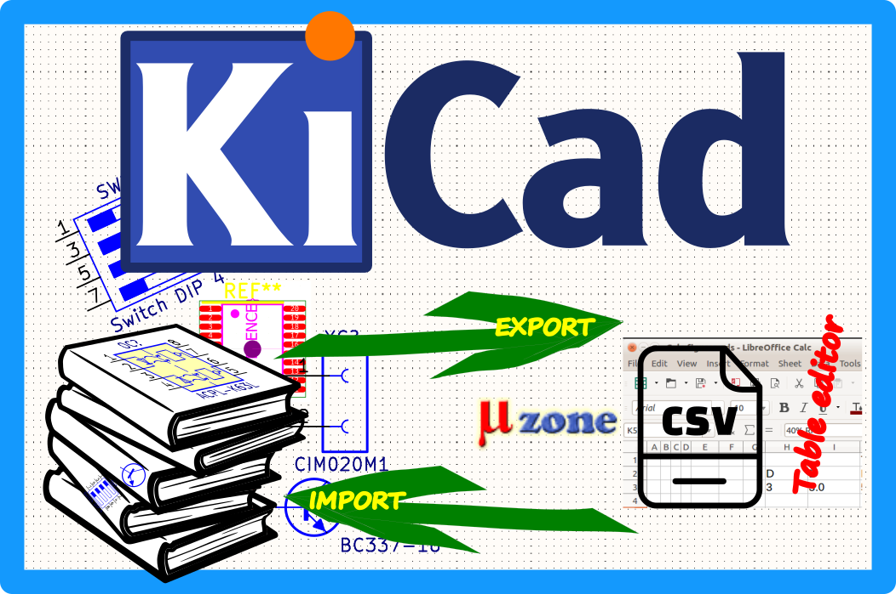

# KiCad librarie's parameters CSV handler

Utility to export KiCad symbols and footprints parameters from the symbol or footprint library to `.csv` format and vice verse with user-defined fields.

This python script help to export selected, or all KiCad's symbol or PCB footprint library elements parameters fields to the file format csv, which you can edit in your favourite table editor (Libre Office, Open Office,..) and next to import back to the KiCad libs.



> Utility is not able to create new parameters, just update the existing one.
> Works with KiCad version 7 only.

## Prerequisites

- Python 3.7 or higher
- Python3-pip
- `requirements.txt`
  - [kiutils](https://github.com/mvnmgrx/kiutils)


## Installation

```sh
pip install -r requirements.txt
# or
python3 -m pip install -r requirements.txt
```


# Usage

## Display help

```
$ python3 kicad-from-to-csv.py --help
usage: kicad-from-to-csv.py [-h] [-d] [-v] -a {import,export} kicad_dirfile csv_dirfile

KiCad to CSV library's parameters exporter

positional arguments:
  kicad_dirfile         Path to directory or single file (.kicad_sym|.pretty)
  csv_dirfile           Path to directory or single file (.csv)

optional arguments:
  -h, --help                    Show this help message and exit
  -d, --debug                   Display debug output
  -v, --version                 Show program's version number and exit
  -a, --action {import|export}  Action to be used for processing (import|export)
```


## Export

```sh
# process single file
python3 kicad-from-to-csv.py -a export <my-file.kicad_sym> my-file.csv

# process all files in directory
python3 kicad-from-to-csv.py -a export <path-to-kicad_sym-directory> my-dir.csv
```


## Import

```sh
python3 kicad-from-to-csv.py -a import <path-to-kicad_sym-directory> my-file.csv
```


# Development

```sh
# create virtual environment
python3 -m venv .venv

# activation
## Linux
source .venv/bin/activate
## Windows
.venv\Scripts\activate.bat
```


## Testing

### Export

```sh
# footprint
python3 kicad-from-to-csv.py -d -a export tests/footprints/footprint.pretty footprint.csv

Processing...
[
 tests/footprints/footprint.pretty/footprint.kicad_mod = [
  CAPAE830X1050N_Case-F = {
   "description": "EIA: Case-F, METRIC: -, JEDEC: -, IPC: CAPAE830X1050N"
   "models": "[Model(path='${KICAD7_3DMODEL_DIR}/SMD_Capacitor_Panasonic/CAPAE800X1050 Size-F.stp', pos=Coordinate(X=0, Y=0, Z=0), scale=Coordinate(X=1, Y=1, Z=1), rotate=Coordinate(X=-90, Y=0, Z=180), hide=False, opacity=None)]"
   "allowMissingCourtyard": "False"
   "boardOnly": "False"
   "excludeFromBom": "False"
   "excludeFromPosFiles": "False"
   "type": "smd"
  },
 ],
]
Done
```


### Import
```sh
# modify description (EIA -> xxxEIA)
sed -i "s/EIA/xxxEIA/" footprint.csv

# update component
python3 kicad-from-to-csv.py -d -a import . footprint.csv
Processing...
[
 tests/footprints/footprint.pretty = [
  CAPAE830X1050N_Case-F = {
   "description": "xxxEIA: Case-F, METRIC: -, JEDEC: -, IPC: CAPAE830X1050N"
   "models": "[Model(path='${KICAD7_3DMODEL_DIR}/SMD_Capacitor_Panasonic/CAPAE800X1050 Size-F.stp', pos=Coordinate(X=0, Y=0, Z=0), scale=Coordinate(X=1, Y=1, Z=1), rotate=Coordinate(X=-90, Y=0, Z=180), hide=False, opacity=None)]"
   "allowMissingCourtyard": "False"
   "boardOnly": "False"
   "excludeFromBom": "False"
   "excludeFromPosFiles": "False"
   "type": "smd"
  },
 ],
]
Done
```
